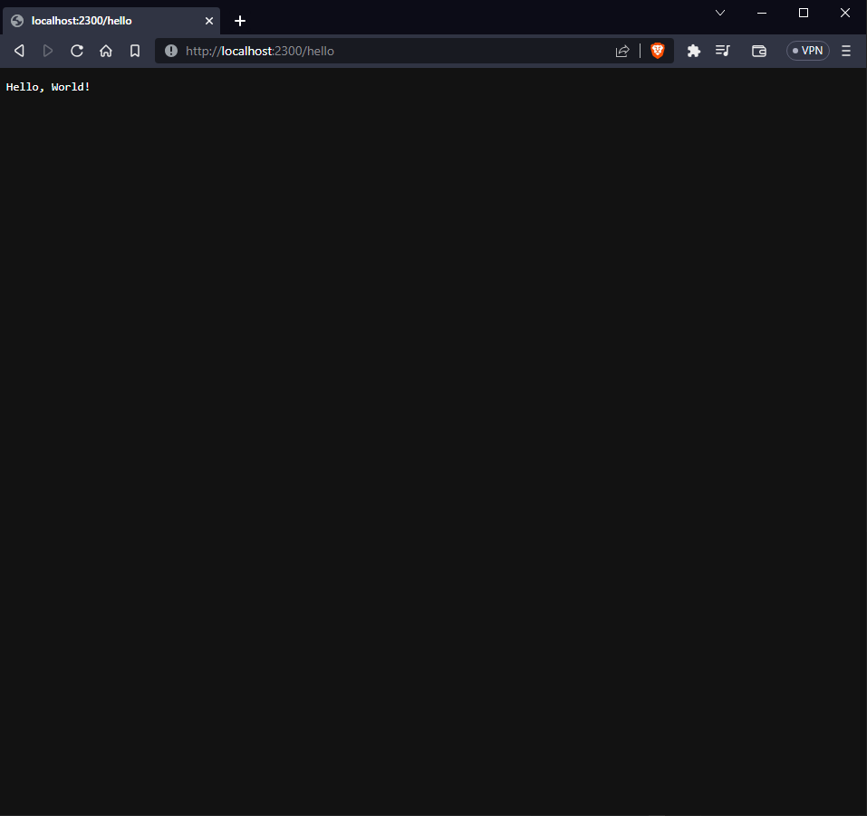

# Minimal server example

Now that you have successfully setup everything, let's create a small example to help you understand how the library works

## Editing main.rs

Let's begin by editing the `main.rs` file

`main.rs` should initially look like this:

```rust
{{#rustdoc_include code-examples/initial.rs}}
```

Let's begin by including the library on the top of our `main.rs` file

```rust, no_run
{{#rustdoc_include code-examples/minimal-server.rs:2}}
```

Next, let's create a new `Server` instance:

```rust, no_run
{{#rustdoc_include code-examples/minimal-server.rs:5:8}}
```

Add a basic handler that always returns a static response:

```rust, no_run
{{#rustdoc_include code-examples/minimal-server.rs:10:12}}
```

Lastly, start the HTTP server:

```rust, no_run
{{#rustdoc_include code-examples/minimal-server.rs:14:16}}
```

Now, if you open your web browser and navigate to `localhost:2300/hello`, you should see a webpage containing the response generated from our bare-bones "Hello, World!" example:

